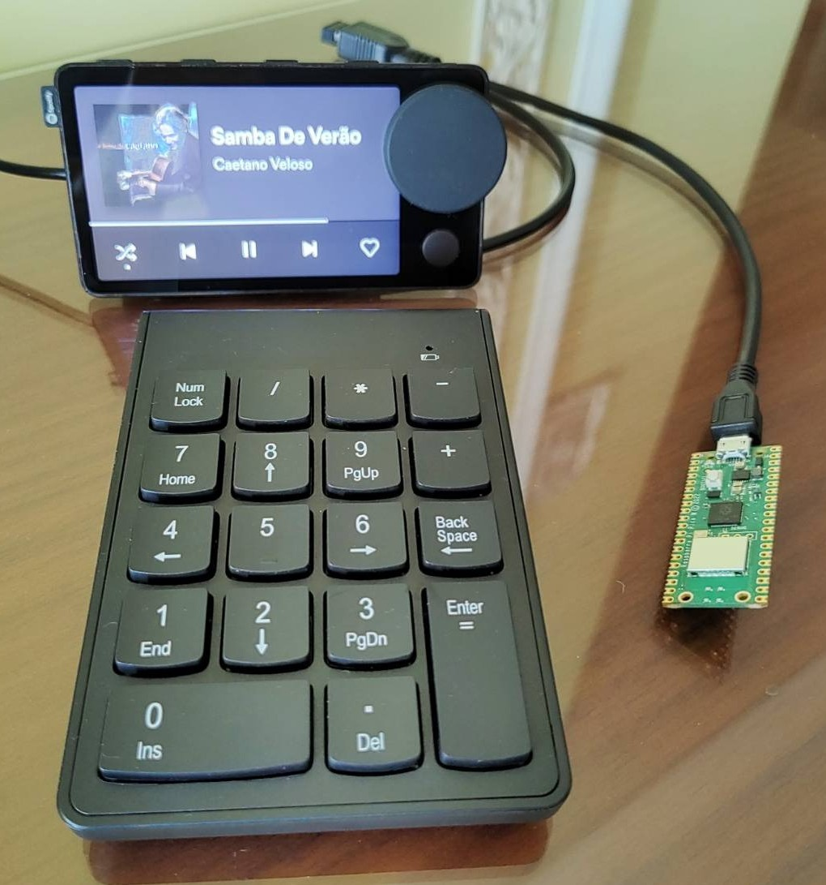

:project-name: Pico W USB Host MQTT Numpad
:rpi-pico-w-ln: Raspberry Pi Pico W
:rpi-pico-w-sn: RPI Pico W
:rpi-pico-ln: Raspberry Pi Pico
:rpi-pico-sn: RPI Pico
:rp2040-sn: RP2040
:experimental:

= {project-name}

The *_{project-name}_* is a proof of concept for the https://www.raspberrypi.com/documentation/microcontrollers/raspberry-pi-pico.html[{rpi-pico-w-ln}]. It demonstrates USB-Host support for a USB numpad which connects via Wi-Fi to an MQTT server. This allows integration with smart home automation software such as https://www.home-assistant.io/[Home Assistant] to control smart devices.

_{project-name}_ is the first project demonstrating Wi-Fi, MQTT, and USB host functionality combined. It cobbles together code from several sketches from the community. The goal is to attract more attention and more skilled developers in the hopes that someone else will build better USB Host support into https://www.arduino.cc/[Arduino], https://micropython.org/[MicroPython], and https://circuitpython.org/[Circuit Python], so that projects like https://tasmota.github.io/docs/[Tasmota] will be able to offer firmware for the {rpi-pico-w-sn}, thereby allowing easier integration of USB devices into smart homes.

_{project-name}_ is usable, but takes some work to get it operational.

.{rpi-pico-w-sn} Running {project-name} with wireless 18-key Numpad and Spotify CarThing

[NOTE]
A Spotify Car Thing is not required for this project, it along with speakers (not pictured) provide feedback that _{project-name}_ is working.

== Inspiration and Motivation

On 2022-12-23, the YouTuber, David Zhang, uploaded a captivating video entitled, https://www.youtube.com/watch?v=DTJSREjWH7Y&t=1s&ab_channel=DavidZhang[ I Built a Keypad to Control My Entire Desk Setup - OLED TV, USB Switch, Lights, Desk, Macros...]. David also posted the project code for _https://github.com/davidz-yt/desk-controller[desk-controller]_ online. David noted that he wished he could use a {rpi-pico-w-sn} instead of a {rpi-pico-ln}, since a {rpi-pico-sn} must be connected to a host PC, but this was limited by his lack of C skills, and perhaps immaturity of existing libraries at the time he was working. This makes using _desk-controller_ in smart home contexts, where a PC is far away or not available, unusable. That's where _{project-name}_ comes in.

_{project-name}_ allows the use of cheap USB devices as smart home controllers. These devices offer immediate tactile feedback to perform simple interactions/routines which our ancestors did by flicking switches. When compared to voice assistants or smart phone applications which require multiple user interactions and time, _{project-name}_ is faster and cheaper.

All of this is motivated by the simple dream of having soothing music play throughout one's home at the press of one *_single_* button.

== Recent Breakthroughs Enabling {project-name}
The https://www.raspberrypi.com/documentation/microcontrollers/rp2040.html#welcome-to-rp2040[{rp2040-sn}] is quite an impressive piece of silicon compared to microcontrollers of the past. Since its introduction, developers have worked to unlock the capabilities of its impressive https://www.raspberrypi.com/news/what-is-pio/[PIO] and USB 1.1 controller w/PHY, which host and device support features. Two projects, https://github.com/sekigon-gonnoc/Pico-PIO-USB[Pico-PIO-USB] and https://github.com/adafruit/Adafruit_TinyUSB_Arduino[Adafruit TinyUSB Library for Arduino], have been started to allow {rpi-pico-sn}s and {rpi-pico-w-sn}s to not only function as USB HID devices, but also act as USB Host devices.

In 2023, a developer by the name of https://github.com/HisashiKato[HisashiKato] began experimenting with USB Host functionality on the {rp2040-sn} and wrote a couple blog posts on the topic http://kato-h.cocolog-nifty.com/khweblog/2023/05/post-74167a.html[ RP2040搭載 Raspberry Pi Pico 互換ボードと TinyUSB Library for Arduino で、RP2040内蔵のUSBコントローラーをUSBデバイスではなくUSBホストとして使おうとしたら大変だった話].

[NOTE]
HisashiKato's blog takes some time to load. A video demonstrating USB host capability with a keyboard, mouse, and playstation gamepad is available at https://github.com/adafruit/Adafruit_TinyUSB_Arduino/discussions/283[GitHub Adafruit_TinyUSB_Arduino Issue 283] and https://github.com/sekigon-gonnoc/Pico-PIO-USB/discussions/75[Pico-PIO-USB Issue 75].

_{project-name}_ simply builds on the work of HisashiKato. They deserve the majority of the credit for investing the time to develop this, create videos, and post questions.

The Wi-Fi and MQTT code used in _{project-name}_ was adapted from https://ithelp.ithome.com.tw/articles/10295387?sc=iThelpR[Max Cheng].

The rest of this code took a couple days to put together and some documentation details may have been forgotten.

[WARNING]
All code for USB gamepads or mice was removed!

== Familiarization Tips
Running Arduino on the {rpi-pico-w-sn} takes some getting used to given the amount of technologies which are not available on the venerable Atmel 328 devices. There are a lot of possible failure points, so it's best to slowly acclimate to dealing with these technologies:

* Multiple serial ports, and remapping them.
* Multicore setup and loops
* Wi-Fi
* MQTT

== Setup Instructions
Complete these steps to install _{project-name}_ on a {rpi-pico-w-sn}:

. Purchase, acquire, or repurpose the materials listed in <<bom>>.
. Ensure a 2.4 GHz wireless network, MQTT server, and Home Assistant instance are operational. The configuration of these tools is out of the scope of this document.
. Install the https://www.arduino.cc/[Arduino] IDE.
. Restart/Reboot if prompted, if on Debian add the relevant user to to the dialout group to allow USB access.
. Install the {rp2040-sn} board Arduino libraries.
.. Open menu:File[Preferences].
.. Paste `https://github.com/earlephilhower/arduino-pico/releases/download/global/package_rp2040_index.json`, into the *Additional Boards Manager URLs* location.
.. Click btn:[OK].
. Ensure that the required additional libraries are installed.
.. Open menu:Tools[Library Manager].
.. Install these libraries:
*** WiFi101
*** Adafruit TinyUSB Library
*** Pico PIO USB
*** PubSubClient
. Restart/Reboot if prompted.
. Modify the Adafruit_TinyUSB_Library's `tusb_config_rp2040.h` file to enable USB host functionality: +
The changes made by HisashiKato are on lines 36-100. +
On Debian Linux this file is installed to `/home/{username}/Arduino/libraries/Adafruit_TinyUSB_Library/src/arduino/ports/rp2040/tusb_config_rp2040.h`
.. Make a backup of the `tusb_config_rp2040.h`.
.. Modify the contents of the file `tusb_config_rp2040.h` +
To easily do this, simply replace the existing `tusb_config_rp2040.h` with the `tusb_config_rp2040.h` in this repository.
. Modify the `pico-w-usb-host-mqtt-numpad.ino` sketch to add the Wi-Fi and MQTT credentials:

[source,c]
----
include::pico-w-usb-host-mqtt-numpad.ino[tag=user-defined-settings]
----
<1> Wi-Fi SSID
<2> Wi-Fi password
<3> MQTT server IPv4 address
<4> MQTT port; 1883 is the default
<5> MQTT username
<6> MQTT password
<7> MQTT Subtopic; leave as-is. It's unclear what this is used for

[start=10]
. (Optional) Uncomment out line 502 to see the MQTT topic the RPI Pico W publishes to. This contains the MAC address. After collecting this information, feel free to comment this statement back out since printing to the console takes CPU time.

[source,c]
----
include::pico-w-usb-host-mqtt-numpad.ino[tag=debug-mqtt-topic]
----

.Example MQTT Topic
[example]
----
Pico_W/USB_HID/xx_xx_xx_xx_xx_x/
----

[start=11]
. Configure the board settings:
.. Choose the {rpi-pico-w-sn} by opening menu:Tools[Board > Raspberry Pi 2040 Boards(3.4.1)]. Select btn:[{rpi-pico-w-ln}].
.. Set the CPU speed by opening menu:Tools[CPU Speed]. Select btn:[120 MHz].
.. Select the USB Stack speed by opening menu:Tools[USB Stack]. Select btn:[Adafruit TinyUSB].
. (Optional, but recommended) Configure the secondary USB to UART device:
.. Connect the ground of the {rpi-pico-w-sn} to the ground on the USB to UART device.
.. Connect pin 9 (Tx) of the {rpi-pico-w-sn} to Rx on the USB to UART device.
.. Connect pin 8 (Rx) of the {rpi-pico-w-sn} to Tx on the USB to UART device.
.. Open a second instance of the Arduino IDE and open the serial monitor on the secondary USB to UART device.
. Connect a {rpi-pico-w-sn} to the host PC while holding down the boot select button to enable uf2 mode.
. Compile the sketch and upload.
.. Ignore the compiler warnings about the char* variables.
. Begin testing operation by completing these steps:
.. Watch the serial monitor of the secondary USB to UART device for the set up information and to verify the {rpi-pico-w-sn} connects to the Wi-Fi network, gets an IP address, and connects to the MQTT server.
.. Attach a USB device and watch the debug information.
.. Press numpad keys and observe the output.

== Configuring Home Assistant
These instructions assume the instance of Home Assistant is already configured for MQTT operation. See <<implementation>> for more information about how _{project-name}_ works to understand the impact on Home Assistant. 

The examples here use the Spotify and Snapcast integrations. The Spotify integration likely requires a paid subscription. At time of writing, Home Assistant scripts are located in the WebGUI at the menu:Settings[Automations & Scenes]. They are presented as YAML examples.

Use these examples to help write automation routines.

=== Automation Example: Spotify Play/Pause
This example demonstrates how to play/pause Spotify from a numpad connected to an {rpi-pico-w-sn} running _{project-name}_.

* Pressing the asterisk (*) pauses the media player. The numeric value is 85.
* Replace the `xx_xx_xx_xx_xx_xx` with the MAC address of the {rpi-pico-sn}.
* Replace the `<spotify_username>` with your spotify username. 

[#spotify_play_pause]
[source,yaml]
----
alias: "RPI Zero W USBHID: <*> = Spotify: Play/Pause"
description: ""
trigger:
  - platform: mqtt
    topic: Pico_W/USB_HID/xx_xx_xx_xx_xx_xx/
    payload: 85
condition: []
action:
  - service: media_player.media_play_pause
    data: {}
    target:
      entity_id: media_player.<spotify_username>
mode: single
----

=== Automation and Script Example: Spotify Mute/Unmute Specific Snapcast Client 
This example demonstrates how to mute/unmute a Snapcast client from a numpad connected to an {rpi-pico-w-sn} running _{project-name}_.

Muting/Unmuting a Snapcast client is a two-part process. 

. The <<automation_spotify_mute_unmute>> watches a specific MQTT topic for the `0` keypress, which has the payload of 98.
. The automation calls the script <<script_snapcast_client_name_mute_unmute>>.

[#automation_spotify_mute_unmute]
[source,yaml]
----
alias: "RPI Zero W USBHID: <0> = Spotify: Mute/Unmute"
description: ""
trigger:
  - platform: mqtt
    topic: Pico_W/USB_HID/xx_xx_xx_xx_xx_xx/
    payload: 98
condition: []
action:
  - service: script.<scriptnumber_goes_here>
    data: {}
mode: single
----

[#script_snapcast_client_name_mute_unmute]
[source,yaml]
----
alias: <snapcast_client_name> Volume Mute/Unmute
sequence:
  - service: media_player.volume_mute
    data:
      is_volume_muted: >-
        {{ not state_attr('media_player.snapcast_client_xx_xx_xx_xx_xx_xx',
        'is_volume_muted') }}
    target:
      entity_id:
        - media_player.snapcast_client_xx_xx_xx_xx_xx_xx
mode: single
----

[#implementation]
== Implementation and Design Constraints
_{project-name}_'s design is impacted by many decisions made by previous authors.

* _{project-name}_ only operates on key presses, not key releases.
* Keys cannot be held down to repeat.
* N-key rollover is not supported.
* _{project-name}_ simply publishes numeric values to MQTT topics. Therefore, it's best to write Home Assistant scripts which either toggle actions, or increase/decrease specific values.
* Before beginning, it's important to understand the keycode mapping Arduino uses. A graphical representation is available in this thread https://forum.arduino.cc/t/hid-keyboard-key-codes/1011438[on the Arduino forums]. The table <<keycodes>> provides a list. 

[CAUTION]
Arduino key code mapping does not match PC key code mapping. Do not expect to be able to use a utility like `xev` or `tkinter` to get the proper code!

[INFORMATION]
When Numlock is enabled, a keyboard actually sends another key.

[#keycodes]
.Key Codes
[%header, cols="7"]
|===

|Key
|Keycode
|Numlock Key On
|Keycode
|PC
|PC_Keycode
|Value Sent with Numlock on (+100)

|Numlock Prefix
|83
|n.a.
|n.a.
|n.a.
|n.a.
|n.a.

|Numlock
|243
|n.a.
|n.a.
|Num_Lock
|77
|n.a.

|1
|89
|End
|77
|KP_1
|87
|189

|2
|90
|Down
|81
|KP_2
|88
|190

|3
|91
|Page Down
|78
|KP_3
|89
|191

|4
|92
|Left
|80
|KP_4
|83
|192

|5
|93
|Blank
|?
|KP_5
|84
|193

|6
|94
|Right
|79
|KP_6
|85
|194

|7
|95
|Home
|74
|KP_7
|86
|195

|8
|96
|Up
|82
|KP_8
|87
|196

|9
|97
|Page Up
|75
|KP_9
|89
|197

|0
|98
|Insert
|73
|KP_0
|90
|198

|.
|99
|Delete
|76
|Delete
|119
|199

|/
|84
|n.a.
|n.a.
|KP_Divide
|106
|184

|*
|85
|n.a.
|n.a.
|KP_Multiply
|63
|185

|-
|86
|n.a.
|n.a.
|KP_Subtract
|82
|186

|+
|87
|n.a.
|n.a.
|KP_Add
|86
|187

|Backspace
|42
|n.a.
|n.a.
|BackSpace
|22
|142

|Keypad Enter
|88
|n.a.
|n.a.
|KP_Enter
|104
|88

|===

== Why Not A Commercial or DIY Solution?
Unfortunately, the smart home device market is a tough business. Only a few manufacturers in the market still offer smart home buttons, and none of these are Wi-Fi, 802.11-based. The market has moved on to lower-power solutions which require different hardware, subscriptions, or proprietary software.

The relative cost per button/switch of a commercial solution must be considered. This is quite high, at more than 15 USD/button. The table <<bom>> shows the _{project-name}_ has an approximate cost of 20 USD. When factoring in the numlock function, 34 user interactions are possible, which computes to 0.58 USD/button. 

This price comparison also shows the advantage of using mass-produced USB devices, compared to 3D-printing or custom-designing hardware; the economies of scale for mass-produced USB devices, which are manufactured in the millions, and far more robust, will never be beaten.

[#bom]
.{project-name} Bill of Materials
[%header, cols="60,20"]
|===
|Item
|Cost (USD)

|{rpi-pico-w-sn}
|6

|USB 18 Key Numpad
|6

|USB OTG Cable w/ USB Mico-B Female, USB Mico-B Male, and USB Type-A Female connectors
|2

|USB UART w/ 2.54" headers (for debug) +
Optional, but recommended for troubleshooting
|2

|USB 5 V Power Supply
|2

|Accessories (Additional USB cables, Dupont Connectors, and logic probe clips)
|2

a|*Total*
a|*20 USD*

|===

== Security Concerns
Wireless USB dongles are unencrypted and likely open to replay attacks. If these issues are of concern, simply use wired USB devices.

== Known Issues

* Full size keyboards do not work properly. Numlock is always detected as being enabled. It might be possible to send a command to the keyboard to disable the numpad setting, as well as turn on LEDs.

== Future Fixes

* [ ] Figure out how to plug in multiple numpads and have each publish to a different MQTT topic. + 
This might possible by passing the `dev_addr` ID to the function which publishes messages to the MQTT topic.

* [ ] A better approach to deal with the limitations in <<implementation>> might be to use `process_kbd_report`. This is discussed in this thread on the https://forums.raspberrypi.com/viewtopic.php?t=350490[Raspberry Pi forums]. +
This file may hold the answer https://github.com/Memotech-Bill/MEMU/blob/cfbe6b5b45acadbce5794b890fc4cf84a62816f9/src/memu/kbd_pico.c#L641[kbd_pico.c]

* [ ] Add WOL functionality which does not rely on MQTT. Possibly add a static IP in the event of a DHCP problem.

== Future Projects / Other Things Worth Checking Out

* https://gitlab.com/baiyibai/bybs-knowledge-base/-/blob/main/projects/keep_alive_audio/keep_alive_audio.adoc[Using Systemd to Keep Speakers with Automatic Sleep Function Alive]
* {rp2040-sn}-based USB switch (TBD) +
Once PIO/USB is better understood, it should be possible to create a create a multi-port USB switch, with one {rpi-pico-sn} with USB host mode connected to a keyboard and mouse, with additional {rpi-pico-sn}s passing data to other PCs. This would avoid the USB connect/disconnect delay current 'dumb' USB switches have.

== Project License
HisashiKato attached the code _{project-name}_ as a .zip file, with implementation instructions on their blog without a license. However, the original code appears to be under the MIT license Copyright 2019 by Ha Thach. Therefore, in the spirit of open source, this project inherits the MIT License.

== Acknowledgements
Thank you very much to HisashiKato, David Zhang, Max Cheng, Ha Thach, and the countless others who contributed to the projects which made this possible.